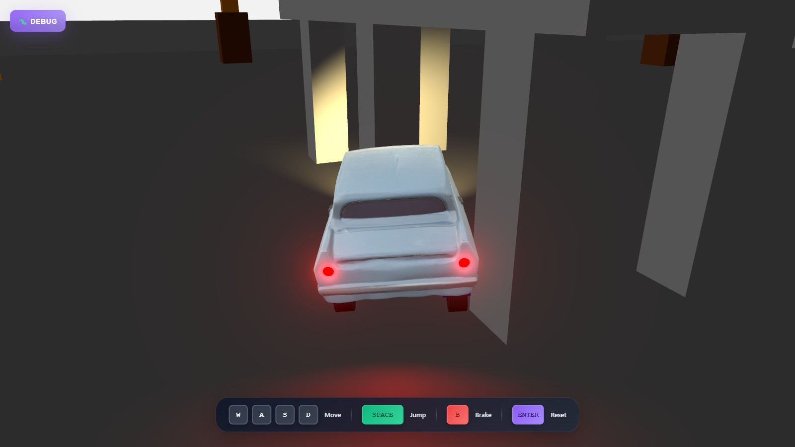

# 🏎️ Three.js + Rapier Car Racing Game

A Three.js + Rapier port of the [Babylon.js Car Racing Game](https://github.com/manuelhintermayr/babylon-js-car-example): the same 3D car playground with realistic joint-based car physics, intelligent device detection, a custom 3D car model, dynamic lighting and a modular Vue.js component architecture. Only the engine underneath changed: **Babylon.js → Three.js** for rendering and **Havok → Rapier** for physics.



## 🔁 What Was Ported

Every feature of the original showcase is reproduced on the new stack. The Vue components, stylesheets, controls and telemetry are identical; the whole 3D and physics layer was rewritten.

| Original (Babylon.js + Havok) | Port (Three.js + Rapier) |
|---|---|
| `BABYLON.Engine` / `Scene` render loop | `THREE.WebGLRenderer` with `setAnimationLoop` and `THREE.Timer` |
| Havok physics plugin, gravity `-150` | `RAPIER.World`, gravity `-150`, fixed 120 Hz timestep with an accumulator |
| `PhysicsShapeConvexHull` car body, mass 5000, center of mass `(0, -2.5, 1)` | `ColliderDesc.convexHull` from the baked model vertices with explicit mass properties |
| Wheel / axle cylinders with `Physics6DoFConstraint` (soft suspension, steering axis, wheel spin) | Joint chain per wheel: revolute (steering) → prismatic (spring suspension) → revolute (spin) |
| Velocity motor on the front wheels with a max force, position motor for steering | `configureMotorVelocity` / `configureMotorPosition` with `setMotorMaxForce` (force based motors) |
| Collision filter masks (car parts never collide with each other) | Rapier collision groups with the same membership / filter split |
| `FollowCamera` with mouse orbit | Hand-written follow camera with the same radius, height offset, acceleration and orbit control |
| `GlowLayer` for emissive lamps | Selective bloom (`UnrealBloomPass`) for the objects on a dedicated glow layer |
| `ReflectionProbe` on the car material | `CubeCamera` reflection probe feeding the car's PBR material |
| `HemisphericLight`, `SpotLight` headlights with shadows and taillights | `HemisphereLight`, shadow-casting `SpotLight` headlights and a red taillight spot |
| Race track, walls, towers, bridge, five knockable boxes | Same geometry, materials and physics parameters |

The gameplay numbers stay the same: speed ramps, steering steps, jump impulses, collision heuristics and the knocked-box detection use the original values. Measured side by side, both versions accelerate from 0 to 150 units in about three seconds and rest at the same ride height.

## 🚀 Architecture

### **No Build Step**
- **ES6 modules with an import map** – Three.js and Rapier are loaded from jsDelivr, Vue.js from unpkg
- **Static hosting** – any web server that serves the folder is enough
- **Modern JavaScript** with async/await, classes and small single-purpose modules

### **Component-Based UI**
- **Vue.js 3** components (`info-panel`, `desktop-controls`, `mobile-controls`) taken over unchanged
- **Props-based data flow** from the game telemetry into the debug panels
- **Event-driven communication** for touch controls and reset

### **Game Modules**
- **`game/three-game.js`** – public entry points (`initializeGame`, `resetGame`, `resetBoxes`) and the render loop
- **`game/game-session.js`** – one playable round: scene, physics world, car, environment and the per-frame update
- **`game/car.js`** – car assembly on Rapier: chassis, suspension, steering and wheel joints
- **`game/world.js`** – studio environment with track, walls, towers, bridge and knockable boxes
- **`game/controls.js`**, **`game/telemetry.js`**, **`game/follow-camera.js`** – input, HUD data and camera
- **`game/rendering.js`** – renderer, selective glow post-processing and the reflection probe

### **Intelligent Device Detection**
- **CSS media queries** for accurate touch device detection
- **Automatic UI adaptation** based on input capabilities
- **Cross-platform compatibility** (Desktop + Mobile + Tablets)

## 🎮 Game Features

### 🏁 Core Gameplay
- **Joint-based car physics** powered by [Rapier](https://rapier.rs/): every wheel is a rigid body with its own suspension, steering and spin joints
- **Custom 3D car model** loaded with the Three.js `GLTFLoader` (model created with [ImgTo3D.ai](https://www.imgto3d.ai/), textures with [Meshy.ai](https://www.meshy.ai/))
- **Convex hull collider** generated from the car mesh for accurate body collisions
- **Follow camera** with mouse orbit and smooth acceleration
- **Jump mechanics** with the Space key and precision **braking** with the B key
- **Ackermann steering** – the inner wheel turns sharper than the outer wheel

### 🎯 Game Objectives & Environment
- 🎯 **Knock down boxes** – Hit all 5 orange physics-enabled targets
- 💥 **Navigate obstacles** – Avoid brown collision towers strategically placed around the track
- 🌉 **Bridge challenges** – Jump onto the elevated bridge platform
- 🏎️ **Speed challenges** – Test vehicle performance on the 800 × 800 studio track
- 🎨 **Studio environment** – Race in a white-walled studio setting

### 💡 Dynamic Lighting System
- **Warm white headlights** (#ddc584) with a shadow-casting spot light
- **Red taillights** with a red spot light washing the floor behind the car
- **Selective glow** on the lamps, like the Babylon.js glow layer
- **Live reflections** on the car body from a cube camera reflection probe
- **Dark ambient lighting** for the dramatic racing atmosphere

### 📊 Advanced Telemetry
- **Vehicle telemetry** (speed, 3D position, rotation)
- **Performance metrics** (total collisions, race time, maximum speed)
- **Progress tracking** (knocked boxes counter with physics detection)
- **FPS counter** badge in the top right corner, averaged over half-second windows
- **Interactive debug panels** with F12 / backtick toggle and auto-hide on mobile

## 🖥️ Cross-Platform Controls

### **Desktop Experience**
- **WASD / Arrow Keys** for movement with real-time visual feedback
- **Space Bar** for jumping
- **B Key** for braking
- **Mouse drag** for 360° camera rotation around the vehicle
- **Enter Key** for an instant game reset
- **F12 / Backtick** for the debug panel toggle

### **Mobile Experience**
- **Virtual joystick** for movement
- **Touch brake button** (🚗), **touch jump button** (🚀) and **touch reset button** (🔄)
- **Auto-hiding desktop controls** on touch devices

## 🏗️ Project Structure

```
📦 threejs-rapier-car-example/
├── 📄 .gitignore             # Git ignore patterns
├── 📄 index.html             # HTML template with the import map and module imports
├── 📄 index.js               # 🎯 Application entry point
├── 📄 vue-app.js             # 🎨 Main Vue app with device detection
├── 📄 package.json           # Project metadata and serve scripts
├── 📄 LICENSE                # MIT License
├── 📄 README.md              # Project documentation
├── 📄 THIRD_PARTY_NOTICES.md # Third-party code, libraries and assets
├── 🖼️ preview.jpg            # Game preview screenshot
│
├── 📁 components/            # 🔧 Vue components (unchanged from the original)
│   ├── 📄 info-panel.js      # Debug panel with glassmorphism UI
│   ├── 📄 desktop-controls.js # Keyboard controls display with jump/brake
│   ├── 📄 mobile-controls.js  # Touch controls with joystick & jump
│   └── 📄 fps-counter.js     # FPS badge
│
├── 📁 css/                   # 🎨 Stylesheets (unchanged from the original)
│   ├── 📄 main.css
│   ├── 📄 info-panel.css
│   ├── 📄 mobile-controls.css
│   ├── 📄 desktop-controls.css
│   └── 📄 fps-counter.css
│
└── 📁 game/                  # 🎮 Three.js + Rapier game engine & assets
    ├── 📄 three-game.js      # Entry points: initializeGame, resetGame, resetBoxes
    ├── 📄 fps-meter.js       # Frames per second, averaged over short windows
    ├── 📄 game-session.js    # One round: scene, world, car, environment, update loop
    ├── 📄 physics-world.js   # Rapier world, fixed timestep stepper, collision groups
    ├── 📄 rendering.js       # Renderer, selective glow bloom, reflection probe
    ├── 📄 follow-camera.js   # Follow camera with mouse orbit
    ├── 📄 car.js             # Car assembly: chassis, suspension, steering, wheels
    ├── 📄 car-model.js       # GLB loading and transform baking (cached)
    ├── 📄 car-lights.js      # Headlights and taillights
    ├── 📄 wheel-visuals.js   # Wheel cylinders with tyre texture and axle boxes
    ├── 📄 world.js           # Track, walls, towers, bridge, knockable boxes
    ├── 📄 controls.js        # Keyboard + touch input mapped onto the motors
    ├── 📄 telemetry.js       # Speed, race timer, collision and box detection
    ├── 📄 color.js           # sRGB color helper for the original color values
    ├── 📁 models/
    │   └── 📄 car.glb        # Custom 3D car model (GLB format)
    └── 📁 textures/
        └── 📄 tire.png       # Car tire texture
```

## 🛠️ Technology Stack

- **[Three.js](https://threejs.org/) 0.185** – WebGL rendering, GLTF loading, post-processing
- **[Rapier](https://rapier.rs/) 0.20** (`@dimforge/rapier3d-compat`) – Rust physics engine compiled to WebAssembly
- **[Vue.js 3](https://vuejs.org/)** – Reactive UI components
- **Import maps** – dependency loading without a bundler

## 🚀 Getting Started

### **Prerequisites**
- A modern browser with import map support (Chrome 89+, Firefox 108+, Safari 16.4+)
- A local web server (required for ES6 modules)
- Internet access on first load (libraries are fetched from CDNs)

### **Local Development Setup**

1. **Clone the repository**
   ```bash
   git clone https://github.com/manuelhintermayr/threejs-rapier-car-example.git
   cd threejs-rapier-car-example
   ```

2. **Start a local server**
   ```bash
   # Using Python
   python -m http.server 8000

   # Using Node.js
   npx serve .

   # Using PHP
   php -S localhost:8000
   ```

3. **Open in browser**
   ```
   http://localhost:8000
   ```

4. **Optional: Swap the Car Model**
   - Place your own `car.glb` in `game/models/`
   - All meshes are merged, scaled and baked into one car body; the convex hull collider is generated from it

## 🎮 How to Play

1. **🏁 Start the Game** – open the page, the car drops onto the track; use `F12` or `` ` `` to open the debug panels
2. **🚗 Master the Controls** – WASD to drive, Space to jump, B to brake, mouse drag to orbit the camera
3. **🎯 Complete Objectives** – knock over the 5 orange boxes, avoid the towers, jump onto the bridge
4. **🏆 Push the Limits** – the car accelerates hard and can be launched with a held jump key

## 📝 Porting Notes

- **Handedness** – Babylon.js is left-handed, Three.js is right-handed. The X axis of every scene position is mirrored so the track looks identical; the car still drives towards +Z, which makes +X the car's left side.
- **Colors** – Babylon.js `StandardMaterial` colors are displayed without gamma correction, so the original RGB values are interpreted as sRGB (`game/color.js`) to keep the same look under Three.js' color management.
- **Suspension** – Havok's soft 6DoF limits let the chassis sag about two units under its own weight. The port reproduces this with prismatic joints and a force-based spring motor using the original stiffness and damping values.
- **Motors** – Rapier's joint motors use the force-based model with the original maximum forces, which gives the same acceleration profile and braking behaviour as the Havok velocity and position motors.
- **Detection timings** – knocked-box and collision detection run on simulated physics time instead of wall-clock time, so a slow first frame or a hidden tab cannot produce phantom hits.
- **Reset** – the loaded car model is cached, so resetting the game rebuilds scene and physics world without downloading the model again.

## 🤝 Contributing

1. Fork the repository
2. Create a feature branch (`git checkout -b feature/amazing-feature`)
3. Commit your changes (`git commit -m 'Add amazing feature'`)
4. Push to the branch (`git push origin feature/amazing-feature`)
5. Open a Pull Request

## 📄 License

The original source code of this project is licensed under the MIT License - see the [LICENSE](LICENSE) file for details. The MIT License covers this repository's own source code; the third-party example code it builds on, the libraries it loads and the AI-generated 3D model and textures it uses are documented separately in [THIRD_PARTY_NOTICES.md](THIRD_PARTY_NOTICES.md).

## 🙏 Acknowledgments

- **[babylon-js-car-example](https://github.com/manuelhintermayr/babylon-js-car-example)** – the original game this port is based on ([live demo](https://projects.manuelhintermayr.com/babylon-js-car-example))
- **Three.js Team** – for the rendering engine and the post-processing examples
- **Dimforge** – for the Rapier physics engine
- **Vue.js Team** – for the reactive framework
- **AI Tools** – for 3D model and texture creation:
  - Car 3D model created with [ImgTo3D.ai](https://www.imgto3d.ai/)
  - Car textures created with [Meshy.ai](https://www.meshy.ai/)
- **Babylon.js Community** – for the demos the original car physics and camera controls were based on:
  - Car physics implementation based on [Babylon.js Playground #ANV5OM#139](https://www.babylonjs-playground.com/#ANV5OM#139)
  - Mouse camera controls based on [Babylon.js Playground #FMQX86#1](https://playground.babylonjs.com/#FMQX86#1)

---

*Created with ❤️ and cutting-edge web technologies*
